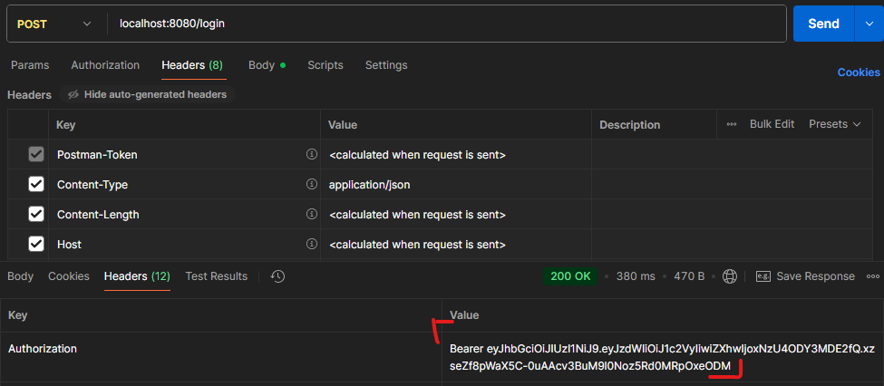

## 최신 버전 build.gradle 설정

3. 자격 증명을 저장하는 새 클래스 추가. Record 개념 사용할 예정. domain 패키지에 AccountCredentials 레코드 생성

- Record 데이터만 보관하는 클래스가 필요할 때 많은 상용구 코드르 피할 수 있는 방식으로,

```java
package com.example.cardatabase.domain;

public record AccountCredentials(String username, String password) {}
```

- 이상과 같이 작성했을 경우 username / password 에 대한 Getter / Setter 를 쓰지 않아도 된다.

# Java Record

- Record는 데이터 운반체(Data Carrier) 역할을 하는 클래스를 간결하게 생성하기 위해 14에서 도입되었고, 16에서 정식 기능이 됐다. 줒로 DTO(Data Transfer Object)나 POJO(Plain Old Java Object)와 같은 불변 데이터 객체를 만들 때 발생하는 반복적인 상용구 코드(boilerplate code) 작성을 줄이는 것을 목적으로 발명됨.

## Record 특징

1. 간결성

- field만을 정의하면, 컴파일러가 필요한 메서드들을 자동으로 생성한다.
- 이상의 경우는 username과 password에 대한 getter / setter 를 자동으로 생성한다.

2. 불변성

- 모든 field는 private final로 선언된다. -> private 이니까 getter/setter로 경유하여 값을 넣어야겠다.

3. 자동생성

- 이하의 멤버들이 자동으로 생성된다.
  1. AllArgsConstructor - () 내에 정의된 모든 field들을 사용하는 생성자를 자동으로 생성함.
  2. 접근자 메서드(Accessor Methods) : 전통적으로 특정 field에 접근하기 위한 접두사인 `get`을 사용하지 않고 field 명을 그대로 사용. person.getName()과 같이 사용하는게 아니라 person.name()

4. 제약사항

- 다른 클래스를 상속 받을 수 없음.
- 다른 인스턴스 field를 선언할 수 없으며, 레코드 header에 정의된 field들 외의 field는 static이어야만 함.

```java
public record Person(String name, int age){
  // getter / setter 는 알아서 생성되기 때문에 Lombok 도입 등이 불필요
  // 객체 생성 시의 유효성 검사를 위하여 생성자를 커스텀 할 수 있다.
  public Person{  // AllArgsConstructor 가 기본이기 때문에 괄호가 없다.
    if (age < 0){
      throw new IllegalArgumentException("불가능한 나이 입력입니다.")
    }
  }
}

public class PersonMain {
  public static void main(String[] args){
    // Record를 통한 객체 생성 및 사용 방법 예시들 작성.
    Person person1 = new Person("김일", 21);  // AllArgsConstructor가 기본생성이기 때문에 얘로만 객체 생성 가능
    String name = person1.name();
    System.out.println(name + " 학생은 " + person1.age() + " 살입니다.");
    System.out.println(person1.toString());   // 원래 toString()은 직접 호출하지 않고 객체명만으로 뽑아낼 수 있었지만 뭐 이런식으로 사용한다 Person[name=김일, age=21]
  }
}
```

#Java Optional
`java.util.Optional` 클래스는 Java 8에서 도입되었고, _값이 있을 수도 있고, 없을 수도 있는(present or absent)_ 컨테이너 객체. 주요 목적은 null 값을 직접 처리하지 못하도록 하여, 프로그래머의 실수를 줄이고 흔히 말하는 `NullPointerException`예외를 방지하는 것이다.

## Optional 특징

1. NPE 방지

- 메서드의 return 값이 null이 될 가능성이 있을 때(findByUsername(username)의 결과값이 null일 수 있는 것처럼), Optional 을 도입하면 호출자는 명시적으로 값이 없을 때의 상황을 처리하도록 강제된다(빼먹고 지나갈 수 없으니까 오류 발생 안함.)

2. 함수형 스타일

- map(), filter(), ifPresent() 등의 메서드를 제공하고 함수형 프로그래밍 스타일로 코드를 작성할 수 있다.

3. 의도 노출

- Optional을 도입한다는 것만으로도 특정 메서드의 return값이 null이 될 수 있음을 다른 개발자들이 쉽게 알 수 있다.

### Optional 객체 생성 및 사용 방법

1. Optional.of(T value)

- null이 아닌 값으로 Optional을 생성. 만약 이 메서드의 호출로 value에 null을 넣으면 NullPointerException 발생함.

2. Optional.ofNullable(T value)

- value가 null일 수도 있는 값으로 Optional 생성. null이면 Optional.empty()를 return

3. Optional.empty()

- 값이 없는 비어있는 Optional 객체를 return.

### 데이터 처리 메서드(NPE 방지 및 대체)

1. isPresent()

- 값이 존재하면 true 반환

2. get()

- 값을 반환. 값이 없으면 NoSuchElementException을 발생시키므로, isPresent()로 확인 후 사용하거나 다른 메서드를 사용하는 것이 좋다.
- 수업 상황에서의 예시

```java
@Override
    public UserDetails loadUserByUsername(String username) throws UsernameNotFoundException {
        Optional<AppUser> user = userRepository.findByUsername(username);

        UserBuilder builder = null;
        if (user.isPresent()){  // 이하의 실행문이 실행된다면 user에 AppUser 객체가 있다는 의미 // 이 부분에서 Optional의 메서드를 사용함.
            AppUser currentUser = user.get();                                               // 여기서도 사용. 1,2번 메서드 사용.
            builder = User.withUsername(username);
            builder.password(currentUser.getPassword());    // 현재상태에서 가져오기
            builder.roles(currentUser.getRole());
        } else {
            throw new UsernameNotFoundException("User not found.");
        }
        return builder.build();
    }
```

3. orElse(T other)

- 값이 존재하면 그 값을 반환하고 ,값이 없으면 `other`로 전달된 기본 값을 return

4. orElseGet(Supplier <? extends T> other)

- 값이 존재하면 그 값을 반환하고, 값이 없으면 `other`(람다식)의 결과를 반환(orElse와 달리 값이 없는 경우에만 람다식이 호출됨).

5. isPresent(Consumer<? super T> action)

- 값이 존재하는 경우에만 `action`(람다식)을 실행

## Optional 사용 예시

```java
public class Example1 {
  public static void main(String[] ars ){
    Optional<String> maybeNaMe = Optional.ofNullabe(findByUsername(username)) // 값이 null일 수도 이싿

    // 1. 값이 있을 때만 작업 수행하는 .ifPresent() - 람다식 적용
    maybeNme.ifPersent(name -> System.out.pringln("사용자 이름 :  " + name));

    // 2. 값이 없을 때 기본 값 제공ㄴ
    String name = maybeName.orElse("Guest");  // 값이 없으면 "Guest"를 return
    System.out.println("사용자 이름 : " + name);  // 사용자 이름 : Guest가 결과값

    // 3. 값이 없을 때의 예외 발생
    String requiredNaMe = maybeName.ofElseThrow();  // 값이 없으면 NoSuchElementException 발생
  }
}
```

# 로그인을 위한 AcoountCredentials를 Record로 생성했다 이후 과정

1. 로그인을 위한 controller 클래스 생성. `/login` 엔드포인트를 POST 메서드로 호출하고 사용자 이름과 암호를 요청 본문과 함께 전송하여 로그인할거다(그러니까 Spring Security의 default를 사용하지 않겠다는 의미가 되겠다).

- web 패키지 내에 LoginController 클래스 생성.
- 로그인 성공 시에 JWT를 생성하는 데 이용될 JwtService 인스턴스를 컨트롤러 클래스에 삽입해야 한다. 이하는 그 과정을 풀어낸 코드이다.

```java
package com.example.cardatabase.web;

import com.example.cardatabase.service.JwtService;
import org.springframework.http.ResponseEntity;
import org.springframework.security.authentication.AuthenticationManager;
import org.springframework.web.bind.annotation.PostMapping;
import org.springframework.web.bind.annotation.RequestBody;
import org.springframework.web.bind.annotation.RestController;

@RestController
public class LoginController {
    // field 선언 -> final 키워드
    private final JwtService jwtService;
    private final AuthenticationManager authenticationManager;

    // 그렇기 때문에 필수적으로 AllArgsConstructor로 생성해야만 하고
    public LoginController(JwtService jwtService, AuthenticationManager authenticationManager) {
        this.jwtService = jwtService;
        this.authenticationManager = authenticationManager;
    }

    // POST 요청을 위한 method를 작성 중인데
    // 저희가 field로 받아온 부분을 사용하여 method 호출을 loginController의 getToken() 메서드 내에서 하겠지
    @PostMapping("/login")
    public ResponseEntity<?> getToken(@RequestBody. AccountCrendtials credential){
        // 여기에 토큰 생성 응답의 Authorization 헤더로 전송해 주는 로직 작성할거다.
    }

}
```

1. ResponseEntity 클래스

- 정의

  - ResponseEntity<T>는 Spring에서 HTTP 응답 전체를 나타내는 클래스로 그래서 Controller 클래스에서 쓰인다. 웹 애플리케이션 컨트롤러 메서드에서 이 클래스ㅡㄹ return 하면, 개발자가 응답의 데이터(Body), HTTP 상태 코드(status Code), 그리고 _HTTP header_ 를 명시적으로 제어하는 것이 가능하다.
    -RESTFUL Api 설계에서 서버의 성태를 클라이언트에게 정확하게 전달하는 데 필수적.

- 주요 특징 및 구성 요소
  1. Body(본문)
  - 클라이언트에게 실제로 전송되는 데이트. 제니릭 `<>` 으로 지정됨.
  - `User` 객체, `List<Product>` 등 (JSON 형태로 변환되어 전송됨(postman에서 JSON 기준이었다.))
  2. Status Code(상태 코드)
  - 요청 처리 결과 상태를 나타내는 3 자리 숫자
  - HttpStatus.OK - (200)
  - HttStatic.CREATEd = (201)
  - HttpsStatuc.Not_FOUND - ( 404)
  3. Headers (헤더)
  - 응답에 대한 추가적인 메터 데이터
  - HttpHeaders.CONTENT_TYPE
  - HttpHeaders.AUTHORIZATION
  - HttpHeaders.LOCATION

## `ReponseEntity<T>` 예씨

```java
import org.springframework.http.HttpStatus;
import org.springframework.http.ResponseEntity;

// 1. 성공 응답( 200 OK )
@GetMapping("/use/{id}")
public ResponseEntity<User> getUser(@PathVariable Long id){
  User user = userService.fndById(id);

  // 상태 코드 200 OK와 User 객체를 응답 본문에 담아서 반환
  return new ResponseEntity<>(user, HTTPStatus.OK); // <User> 위에 작성해서 생략한거임
}

// 2. 생성 성공 응답 ( 201 Created)
// .created() 빌더를 활용하여 Location 헤더를 자동 추가 가능
@PostMapping("/products")
public ResponseEntity<Void> createProduct(@RequestBody Product newProduct){
  Product savedProduct = productService.save(newProduct);

  // 상태 코드 201 Created와 함께 Location 헤더를 반환(Body는 없다-POST 요청할 때 Body를 썼는데요라는 질문을 하게 된다면 우리가 GET 요청할 때는 Body 작성 안했는데 결과값에는 JSON이 있었잖슴 라고 대답할 수 있을 거 같다.)
  // 요청 - Body (o) / 응답 - Body (x)  이 둘의 자료형 주의하기
  return ResponseEntity.created(URI.create("/products" + savedProduct.getId())).build();
}

// 3. 실패 응답 (404 Not Found)
@GetMappnig("/items/{id}")
public ResponseEntity<String> getItem(@PathVariable Long id){
  if( itemService.findItem(id) == null){
    // 상태 코드 404 Not Found와 에러 메시지를 ResponseEntity의 body에 담아서 return
    return ResponseEntity.status(HttpStatus.Not_FOUND).body("해당 item을 찾을 수 없습니다.");
  }
  // 여기 부분은 아이템을 찾았을 때의 로직
  return ReponseEntity.status(HttpStatus.OK);
}
```

# POST 요청 시에 필요한 @RequestBody 애너테이션

- 정의
  HTTP 요청 메서드(POST, PUT, PATCH 등)의 요청 본문(Body)에 담긴 데이터를 읽어와 Spring Controller 메서드의 매개변수로 연결(bining)할 때 사용. 클라이언트가 서버로 데이터를 전송할 때 주로 사용.

- 특징 및 작동 원리

1. 자동 역직렬화 : `@RequestBody`의 핵심 기능으로, 요청 본문에 포함된 JSON, XML 등 데이터의 메서드 매개변수로 지정된 Java 객체로 자동 변환해줬다.
2. 메시지 컨버터(Message Converter) : Spring의 `HttpMessageConverter`가 담당하는 부분으로, 예를 들어 JSON 데이터가 들어오ㅔ 되면 Jackson 라이브러리를 사용하는 컨버티가 이름 JAVA객체로 변환해준다.
3. 데이터 바인딩 : 요청 body의 field 이름과 대상 Java 객체의 field 이름이 일치하면 자동으로 값이 주입된다.

## @RequestBody 사용 예시

```java
@Getter
@Setter
public class Product {
  private String name;
  private int price;
}

// 어쩌고 컨트롤러
@PostMaping("/products")
// 클라이언트 요청 본문의 JSON 데이터를 자동으로 Producct 객체인 product로 변환
public ResponseEntity<String> addProduct(@RequestBody Product product){
  if (product.getPrice() <= 0){
    return ResponseEntity.badRequest().body("가격은 양수여야만 한다."); // 400 BAD_REQUEST
  }

  productService.save(product);
  return ResponseEntity.status(HttpStatus.CREATED).body("상품이 성공적으로 등록되었습니다.");
}
```

- 참고 사항 : `@RequestBody`는 요청 본문(body)이 없는 GET 요청에는 사용할 수 없으며 보통은 _`POST`, `PUT`_ 과 같이 데이터 전송이 필요한 요청에 사용된다.

LoginController의 getToken 메서드 로직 부분

```java
@PostMapping("/login")
    public ResponseEntity<?> getToken(@RequestBody AccountCredentials credentials){
        // 여기에 토큰 생성 응답의 Authorization 헤더로 전송해 주는 로직 작성할거다.
        UsernamePasswordAuthenticationToken creds =
                new UsernamePasswordAuthenticationToken(credentials.username(), credentials.password()); // getter 라고 쓰지 않는다
        // credentials.username() 이거 Record로 만들었기 때문에 getUsername()이 아닌 것에 주목해야 한다.

        Authentication auth = authenticationManager.authenticate(creds);

        // 토큰 생성 - jwts는 지역변수
        String jwts = jwtService.getToken(auth.getName());
         // 생성된 토큰으로 응답을 빌드
        return ResponseEntity
                .ok()
                .header(HttpHeaders.AUTHORIZATION, "Bearer " + jwts)
                .header(HttpHeaders.ACCESS_CONTROL_EXPOSE_HEADERS, "Authorization")
                .build();
     }
```

이상까지 작성했을 때 LoginController의 field로 AutenticationManager를 사용했기 때문에 SecurityConfig에 설정이 추가되어야 한다. 그래서 아직은 실행이 안됨.

SecurityConfig.java 내용 추가

```java
@Bean
    public AuthenticationManager authenticationManager(AuthenticationConfiguration authConfig){
        return authConfig.getAuthenticationManager();
    }
```

이상을 기준으로 스프링 시큐리티 Config 관련을 수정해야 한다. Spring security의 SecurityFilterChain bean은 어떤 경로(엔드포인트)가 보호되고, 어떤 경로가 보호되지 않는지 정의한다. filterChain() 메서드를 추가할건데, 기본적인 정의는 /login 엔드포인트에 대한 POST 요청은 인증이 없어도 허용되도록 작성할거다. 다른 모든 엔드포인트에 대한 요청은 인증이 필요하도록 정의해볼 예정이다. 또한 Spring Security가 세션을 생성하지 않으므로 사이트 간 요청 위조(csrf)를 비활성화 할 수 있도록 정의할거다. JWT는 상태 비저장형(RESTful 웹 서비스의 특징)으로 설계되어 세션 관련 취약성의 위험을 줄여준다. HTTP 보안 구성에서 오랜만에 Lambda Expression을 사용할거다.

# @PathVariable 애너테이션

- 정의 및 목적
  해당 애너테이션은 Spring Web에서 URL의 _경로 변수(Path Variable)_ 에 있는 값을 추출하여 Controller의 메서드의 매개변수로 바인딩 하는 데 사용된다. 이는 특정 리소스를 식별하거나 _조회_ 할 때 RESTful API 디자인을 구현하는 데 핵심적인 역할을 한다.

- 특징 및 작동 원리

1. URL 경로 매핑 : URL 경로의 특정 부분을 변수처럼 `{id}`와 같이 표시하고, 그 변수에 할당된 실제 값을 메서드 매개변수로 가져온다.
2. RESTful 식별자 : 주로 개별 리소스(특정 사용자 ID / 특정 상품 번호 등)를 식별하기 위해 사용되며 URI(Uniform Resource Identifier)의 의미를 명확하게 만들어준다.
3. 자동 타입 변환 : 경로에서 추출된 문자열은 메서드 매개변수의 타입(`long, Integer, String` 등)에 맞게 자동으로 변환된다.

## 예시

```java
public class User {
  private Long id;
  private String name;
  // ...
}

@RestController
@RequestMapping("/api/users")
public class UserController{
  // 1. 단일 경로 변수 사용 예시
  // URI : /api/users/123(id)
  @GetMapping("/{userId}")
  // {userId} 경로의 값 123을 Long 자료형의 userId 변수에 바인딩(대입)
  public ResponseEntity<User> getUserById(@PathVariable("userId") Long Id){
    // PathVariable로 받은 userID를 이용하여 특정 사용자를 조회
    User user = userService.findById(id);

    if(user == null){
      return ResponesEntity.notFound().build();
    }
    return ResponesEntity.ok(user);   // 200 ok와 user 데이터를 응답.
  }

  // 2. 여러 PathVariable 사용 예시
  @GetMapping("/{userID}/orders/{orderId}")
  public ResponseEntity<Order> getUserOrder(
    @PathVariable Long userId, @PathVariable Long orderId
  ) {       // 변수 이름이 같으면 ("userId") / ("orderId")가 생략 가능하다.
    Order order = orderService.findByUserIdAndOrderId(userId, orderId);

    // order가 없으면 뭐 어쩌고 not found 로직 있는데 신경 안씀

    return ResponseEntity.ok(order);
  }
}
```

# 다른 요청 보호하기

밥 먹기 전에 굳이 Login하지 않고도 들어갈 수 있는 엔드포인트인 POST / login 부분을 처리했다.
그러면 이제 나머지 수신 요청에 대한 인증 처리를 다룰 필요가 있다. 인증 프로세스에서는 요청이 Controller에 전달되기 전이나 클라이언트에 응답이 전송되기 전에 일부 작업을 수행할 수 있는 filter를 이용한다.

1. 필터 클래스를 이용, 다른 모든 수신 요청을 인증 처리할거다. com.example.cardatabase에 AuthenticationFilter 클래스를 생성. 해당 클래스는 Spring Security의 OncePerRequestFilter 인터페이스를 _확장(extends)_ 하여 인증을 _구현(method)_ 할 수 있는 doFilterInternal 메서드를 제공한다. request에서 토큰을 확인하기 위해 필터 클래스에 JwtService 인스턴스를 주입. SecurityContextHolder는 Spring Security가 인증된 사용자의 세부 정보를 저장하는 부분에 해당한다. 이하의 코드에서 검증한다.

```java
package com.example.cardatabase;

import com.example.cardatabase.service.JwtService;
import jakarta.servlet.FilterChain;
import jakarta.servlet.ServletException;
import jakarta.servlet.http.HttpServletRequest;
import jakarta.servlet.http.HttpServletResponse;
import lombok.RequiredArgsConstructor;
import org.springframework.http.HttpHeaders;
import org.springframework.security.authentication.UsernamePasswordAuthenticationToken;
import org.springframework.security.core.Authentication;
import org.springframework.security.core.context.SecurityContextHolder;
import org.springframework.web.filter.OncePerRequestFilter;

import java.io.IOException;
import java.util.Collections;

@RequiredArgsConstructor
public class AuthenticationFilter extends OncePerRequestFilter {
    private final JwtService jwtService;

    @Override
    protected void doFilterInternal(HttpServletRequest request, HttpServletResponse response, FilterChain filterChain) throws ServletException, IOException {
        // 토큰 가져오기
        String jws = request.getHeader(HttpHeaders.AUTHORIZATION);
        if (jws != null){
            // 토큰 검증 및 사용자 가져오기
            String user = jwtService.getAuthUser(request);  // 여기 작성 방식이 매우 유사하다.
            // 인증
            Authentication authentication = new UsernamePasswordAuthenticationToken(
                    user, null, Collections.emptyList()
            );
            SecurityContextHolder.getContext().setAuthentication(authentication);
        }
        filterChain.doFilter(request, response);
    }
}
```

이상의 코드에서 중요한 점은 getAuthUser()의 return 타입과 관련된 부분이 되겠다. 직접 정의했기 때문에 확인해야 하는데, 일단 String user라는 부분이다. User user 이런거 아님
그리고 이상의 코드를 작성했기 때문에 SecurityConfig에 filter 관련 클래스가 추가되어야 한다.

```java
@Bean
    public SecurityFilterChain filterChain(HttpSecurity http) throws Exception {
        http.csrf(csrf -> csrf.disable())
                .sessionManagement(sessionManagement ->
                        sessionManagement.sessionCreationPolicy(SessionCreationPolicy.STATELESS))
                .authorizeHttpRequests(authorizeHttpRequests ->
                        authorizeHttpRequests.requestMatchers(HttpMethod.POST, "/login").permitAll().anyRequest().authenticated())
                .addFilterBefore(authenticationFilter, UsernamePasswordAuthenticationFilter.class);
        return http.build();
    }
```

이전에는 `authorizeHttpRequests.requestMatchers(HttpMethod.POST, "/login").permitAll().anyRequest().authenticated());` 여기서 마무리 되었다. 이상의 코드는 기본적으로 `/login` endpoint에 대해 POST 요청을 허용하겠다는 것이기 때문에 나머지 부분에 대해서 JWT가 존재할 때만 요청을 처리하겠다고 추가한 부분이 `.addFilterBefore(authenticationFilter, UsernamePasswordAuthenticationFilter.class);`에 해당한다.

이상까지 작성했을 때, 로그인 이후 과정까지의 워크플로우를 테스트 할 수 있게 되는데, 애플리케이션 실행 후에 POST /login으로 로그인을 하게 되면, Authorization 헤더에 JWT가 존재하는지를 체크할 수 있고, body 내에 유효한 사용자를 추가해야하며, postman을 통해 지정되지 않는 경우 Headers에 Content-Type을 application/json으로 설정해둬야 한다.

login process 완료 //

로그인이 성공했다면 로그인을 통해 받은 JWT Authorization 헤더를 통해 전송하여 다른 RESTful 서비스의 엔드포인트를 호출하는 것이 가능하다. 로그인 응답에서 나온 토큰을 복사한다(Responese의 Header에서 Authorization 부분의 `Bearer `를 제외한). Save Response -> 그리고 응답에서 Authorization 헤더를 추가한 다음에 GET 요청을 해야 한다.

# 예외 처리하기

현재 상황에서 postman에서 /login POST 요청을 날릴 때 우리가 CommandLineRunner에 입력한 더미 데이터와 다른 방식으로 로그인을 시도할 경우(username 오타 혹은 password에서의 오타), 403 에러 메시지가 출력된다. 즉 추가 설명도 없고 그냥 금지됐다고만 안내를 하기 때문에 개발자 / 유저 입장에서는 뭐가 잘못됐는지 알 수 없다는 문제가 있다. 그래서 username/password 오타시에 401 Unauthorized 에러 메시지를 띄우는 등의 세세한 커스텀을 해볼 예정이다.

Authentication 관련 예외를 처리하기 위해서는 AuthenticationEntryPoint 인터페이스를 사용할 수 있다.

1. com.example.cardatabase(앞으로는 그냥 루트 패키지라고 하겠음)에 AuthEntryPoint 클래스를 생성하고, AuthenticationEntryPoint 인터페이스를 \_implement 하세요. -> 예외가 발생하면 응답을 401로 설정하고, 응답 본문에 예외 메시지를 출력하여 안내할 수 있도록 할 예정이다.

```java
package com.example.cardatabase;

import jakarta.servlet.ServletException;
import jakarta.servlet.http.HttpServletRequest;
import jakarta.servlet.http.HttpServletResponse;
import org.springframework.http.MediaType;
import org.springframework.security.core.AuthenticationException;
import org.springframework.security.web.AuthenticationEntryPoint;

import java.io.IOException;
import java.io.PrintWriter;

public class AuthEntryPoint implements AuthenticationEntryPoint {

    @Override
    public void commence(HttpServletRequest request, HttpServletResponse response, AuthenticationException authException)
            throws IOException, ServletException {
        response.setStatus(HttpServletRequest.SC_UNAUTHORIZED);   // 응답
        response.setContentType(MediaType.APPLICATION_JSON_VALUE);
        PrintWriter writer = response.getWriter();
        writer.println("Error : " + authException.getMessage());
    }
}
```

Authentication이 로그인 시에 요구되는 username / password를 입력하여 저희 기준으로 app_user이라는 table 내에 해당 username / password가 존재하는지를 확인하는 과정이었다.

SecurityConfig 관련 설정도 수정해줘야 한다.

다 수정하고 나면 POST /login에서 username / password 중에 하나가 dummy data와 다르다면 예전에는 403이 떴으나 이제는 401이 뜨면서 우리가 설정한 message를 응답 받은 JSON 내용에 들어가게 된다.

# CORS filter 설정

# AppUser Entity 클래스에 role이 있고 "USER", "ADMIN"으로 나누었는데, 그에 따른 권한 분리
